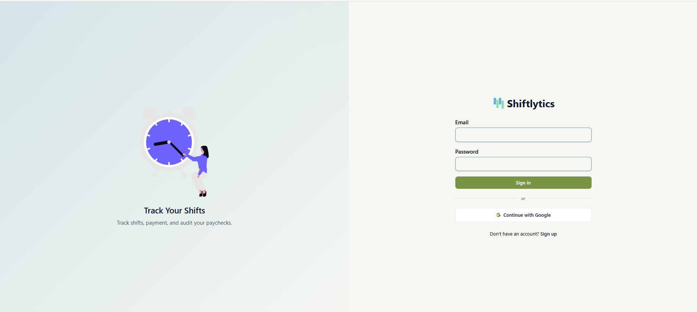
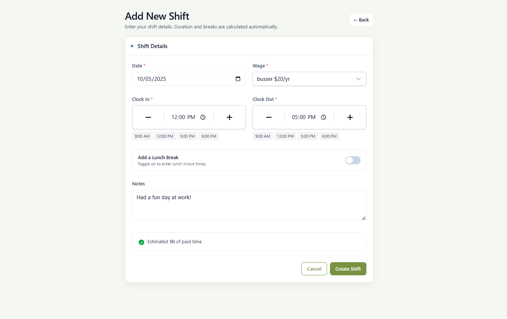
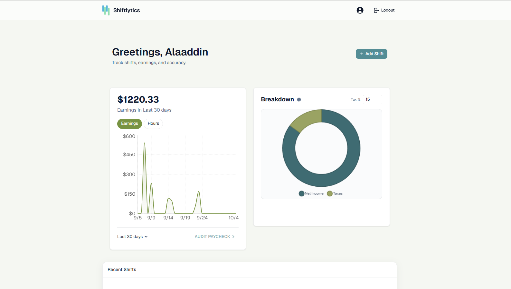
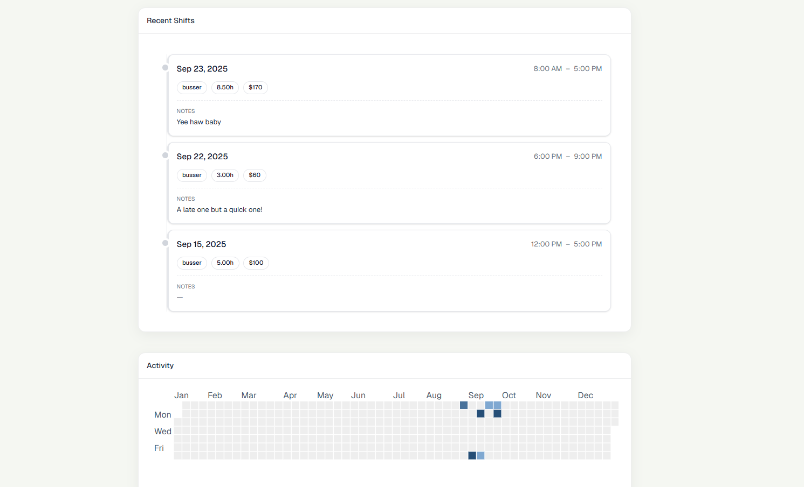
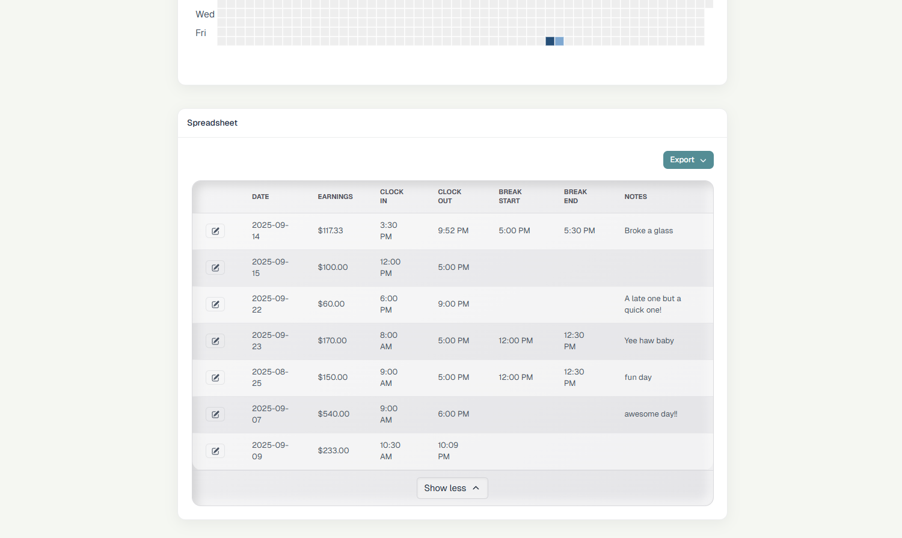
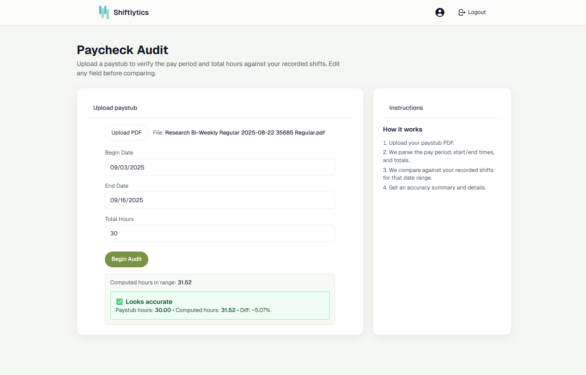

# Shiftlytics

A Shift and Income CRUDtracking tool used to provide spreasheet-tracking and data visualization of your work history.

## 🎯 Features

- **User Authentication**: Sign up or Log in to view your profile data, with the ability to Retrieve, Add, Delete or Update it any time.
- **Visual Dashboard**: A graph view of your day-to-day hourly earnings, a Pie chart to visualize your Net Income, and A Github-styled heatmap to see when you worked the most.
- **Different Roles**: If you possess several different titles at your job, you can use this feature to create several different roles with their own wage.
- **PDF/CSV export**: Sneak-Peak and export a spreadsheet file of all your recorded shifts for your own use.
- **Paycheck Audit Parser**: Upload a paycheck and we will verify if you've been paid correctly by comparing the hours recorded to the hours you have entered.

## 📸 Screenshots


_Friendly login page for users to sign back in or sign up for our service_



_Log new shifts as they come, recorded using seperate work titles, and add your lunch breaks in for accurate accounting_



_Graph, Pie Chart, and Heatmap for data visualization_


_Option to export your recorded data as either a PDF or CSV file for personal keep and offline accessibility_


_Parser tool to audit your paychecks for accuracy by coming the number of hours recorded with what you logged on our app_


## 🚀 Tech Stack

- **Framework**: [Next.js 15.3.0](https://nextjs.org/)
- **UI Components**:
  - [Tailwind CSS](https://tailwindcss.com/) for styling
  - [React.js]() for UI framework
- **Database**
  - [Supabase]() for Data storage and user authentication 

## 🛠️ Installation

1. Clone the repository:

```bash
git clone https://github.com/changerate/shiftlytics
```

2. Install dependencies:

```bash
npm install
```

3. Create a `.env.local` file and add your Gemini API key:

```bash
NEXT_PUBLIC_SUPABASE_URL= (YOUR SUPABASE PUBLIC URL)
NEXT_PUBLIC_SUPABASE_ANON_KEY=(YOUR SUPABASE PUBLIC ANON KEY)
```

4. Start the development server:

```bash
npm run dev
```

5. Open [http://localhost:3000](http://localhost:3000) in your browser

## 💻 Development

- `npm run dev`: Starts development server with Turbopack
- `npm run build`: Creates production build

## 🙏 Acknowledgments

### The Team:
- **Alaaddin Ghosheh**
- **Carlos Vargas**

